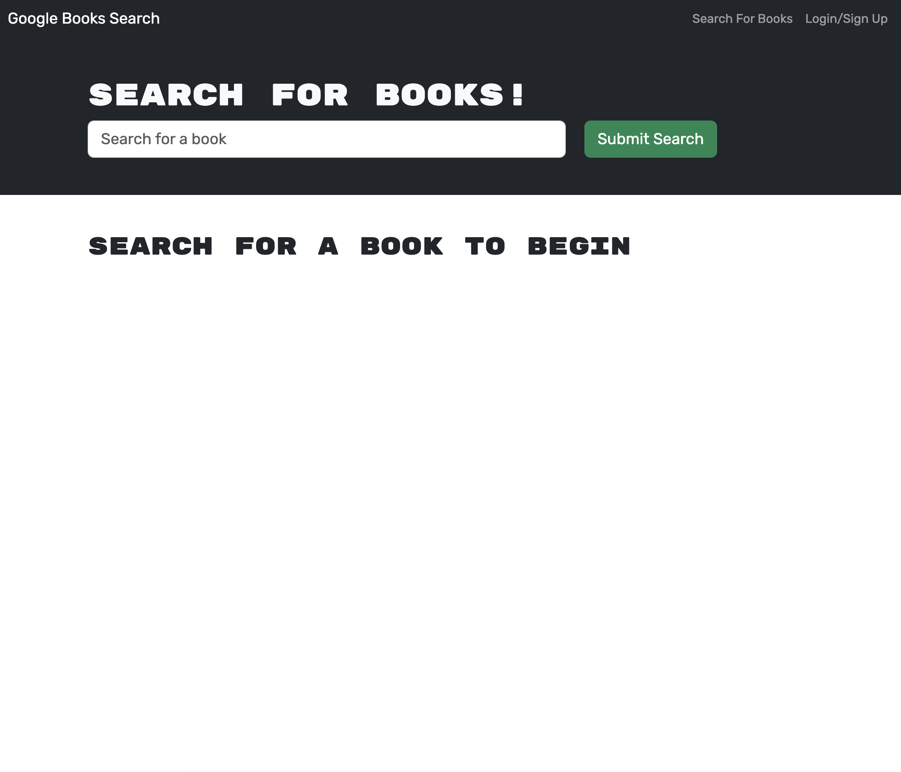

# book-searcher

## Description
This application allows you to search and save books.

## Table of Contents
- [Installation](#installation)
- [Usage](#usage)
- [License](#license)
- [Contributing](#contributing)
- [Tests](#tests)
- [Questions](#questions)

## Installation
N/A

## Usage
To use this application search up books. You can also login or sign up to save books.

## Credits
Cassidy Kovell with help from a tutor and the Xpert Learning Assistant.

## License
N/A

## Badges

## Features 
This tool allows you to search up books as well as save and delete them from your profile.

## How to Contribute
N/A

## Tests
N/A 

## Questions
GitHub Username: cassidykovell
Github Profile link: https://github.com/cassidykovell
Email: cassidy0kovell@gmail.com 
If you have questions email me.